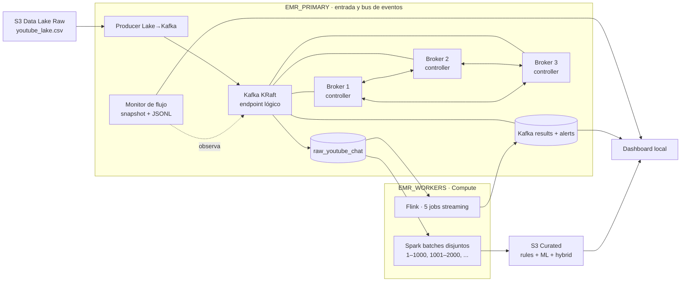

# Radar Electoral Big Data

Plataforma distribuida para analizar comentarios de YouTube Live Chat electoral peruano mediante Kafka, Flink, Spark, reglas lingüísticas locales y modelos OffendES.

**Repositorio:** [github.com/LaterSpec/bigdata-spark-flink](https://github.com/LaterSpec/bigdata-spark-flink)

## Arquitectura vigente



- `EMR_PRIMARY` identifica el clúster dedicado a Kafka. Sus tres nodos ejecutan un quorum KRaft con replicación `3` y `min.insync.replicas=2`.
- `EMR_WORKERS` acepta uno o más endpoints públicos de clústeres EMR separados por comas.
- El primer worker ejecuta Flink. Todos los workers reciben batches Spark por round-robin.
- Kafka es el punto de distribución anterior a ambos motores: Flink y Spark consumen `raw_youtube_chat` de forma independiente.
- `SPARK_BATCH_SIZE` define rangos independientes y `SPARK_MAX_CONCURRENCY=1` mantiene una cola secuencial segura por defecto.

La explicación completa está en [architecture.md](architecture.md).

## Configuración

El archivo local `.env` no se versiona:

```dotenv
EMR_PRIMARY=ec2-xx-xx-xx-xx.compute-1.amazonaws.com
EMR_WORKERS=ec2-aa-aa-aa-aa.compute-1.amazonaws.com,ec2-bb-bb-bb-bb.compute-1.amazonaws.com
DATA_SIZE=30000
SPARK_BATCH_SIZE=1000
SPARK_MAX_CONCURRENCY=1
```

`final.pem` también permanece únicamente en la máquina local. El acceso a los core nodes Kafka usa SSH con salto por `EMR_PRIMARY`; la llave nunca se copia a AWS.

## Inicio

Desde Git Bash, macOS o Linux:

```bash
cd emr_kafka_setup/dashboard
./start_dashboard.sh
```

En Windows PowerShell:

```powershell
cd emr_kafka_setup\dashboard
.\start_dashboard.ps1
```

Abrir `http://127.0.0.1:8787` y pulsar **Conectar AWS**. El arranque descubre los nodos, reinicializa Kafka cuando corresponde, despliega Flink en compute, inicia el monitor y publica desde S3.

**Detener plataforma** detiene `EMR_PRIMARY` y todos los `EMR_WORKERS`: cancela aplicaciones YARN, procesos Flink/Spark, producer, monitor y los tres brokers. También limpia los estados de batch y salud; **Conectar AWS** vuelve a habilitarse únicamente tras confirmar la parada completa.

El dashboard consulta deltas cada `3 s`, estados Spark cada `3 s`, offsets agregados cada `5 s` y salud cada `5 s`. **Flink normalizados** usa el offset confirmado del grupo `flink-job1-normalize`; por eso representa comentarios realmente procesados y nunca mensajes repetidos por una recarga del navegador.

Tras reiniciar una sesión local, vuelve a ejecutar `start_dashboard.ps1` o `start_dashboard.sh`. Para reanudar los servicios remotos conservando topics y offsets:

```bash
./emr_kafka_setup/dashboard/scripts/restart_services_after_session.sh
```

## Operación

- [Comandos desde cero](docs/comandos_levantar_desde_cero.md)
- [Recuperación desde S3](docs/revivir_emr_desde_s3.md)
- [Dashboard y API](emr_kafka_setup/dashboard/README.md)
- [Validación distribuida](docs/DISTRIBUTED_RUNTIME_VALIDATION.md)
- [Arquitectura Kafka](emr_kafka_setup/docs/kafka_setup_report.md)
- [Flink streaming](emr_kafka_setup/docs/flink_jobs.md)
- [Spark desde Kafka](emr_kafka_setup/docs/spark_batch_from_kafka_full_report.md)

Los planes de Spark Batch, pruebas y reportes de modelos se conservan como evidencia histórica. Cuando contradigan esta página, prevalece la arquitectura vigente.
