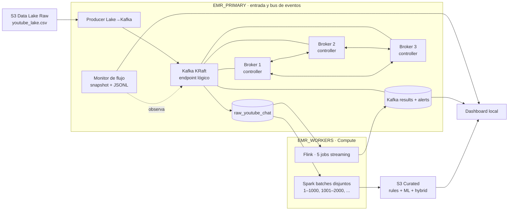

# Radar Electoral Big Data

Plataforma distribuida para analizar comentarios de YouTube Live Chat electoral peruano mediante Kafka, Flink, Spark, reglas lingüísticas locales y modelos OffendES.

**Repositorio:** [github.com/LaterSpec/bigdata-spark-flink](https://github.com/LaterSpec/bigdata-spark-flink)

## Setupeo de clústeres

La plataforma usa **dos tipos de clúster EMR** con roles fijos:

| Clúster | Qué corre ahí | Notas |
|---|---|---|
| `EMR_PRIMARY` | **Kafka KRaft**, producer Python, monitor | Tres instancias (`primary` + 2 core). Los tres nodos son broker y controller. Kafka **no** va en los workers. |
| `EMR_WORKERS` | **Flink** (5 jobs) y **Spark** (batches) | Uno o más endpoints EMR separados por comas. Flink se despliega en el primer worker; Spark se reparte round-robin. |

Flujo resumido: `S3 Raw → producer (primary) → Kafka (primary) → Flink/Spark (workers)`.

La explicación completa está en [architecture.md](architecture.md). El runbook de comandos está en [docs/comandos_levantar_desde_cero.md](docs/comandos_levantar_desde_cero.md).

## Arquitectura vigente



- `EMR_PRIMARY` concentra el bus de eventos: quorum Kafka de tres nodos, replicación `3` y `min.insync.replicas=2`.
- `EMR_WORKERS` concentra el cómputo: Flink y Spark consumen `raw_youtube_chat` desde Kafka en el primary.
- `SPARK_BATCH_SIZE` define rangos disjuntos de 1,000 eventos; `SPARK_MAX_CONCURRENCY=1` mantiene una cola secuencial segura por defecto.

## Configuración local

Crea un `.env` en la raíz del repo (no se versiona):

```dotenv
EMR_PRIMARY=ec2-xx-xx-xx-xx.compute-1.amazonaws.com
EMR_WORKERS=ec2-aa-aa-aa-aa.compute-1.amazonaws.com,ec2-bb-bb-bb-bb.compute-1.amazonaws.com
DATA_SIZE=30000
SPARK_BATCH_SIZE=1000
SPARK_MAX_CONCURRENCY=1
```

También necesitas `final.pem` en la raíz. La llave **no** se copia a AWS; el acceso a los core nodes Kafka usa SSH con salto por `EMR_PRIMARY`.

## Comandos esenciales

### 1. Levantar el dashboard (plano de control local)

Git Bash, macOS o Linux:

```bash
cd emr_kafka_setup/dashboard
./start_dashboard.sh
```

Windows PowerShell:

```powershell
cd emr_kafka_setup\dashboard
.\start_dashboard.ps1
```

Abrir `http://127.0.0.1:8787` y pulsar **Conectar AWS**. El bootstrap descubre nodos, prepara Kafka en el primary, despliega Flink/Spark en workers, inicia monitor y publica desde S3.

### 2. Bootstrap directo (sin dashboard)

Desde `emr_kafka_setup/dashboard`:

```bash
./scripts/bootstrap_emr_streaming.sh
```

Sesión limpia (reinicia topics y offsets):

```bash
./scripts/bootstrap_emr_streaming.sh --reset-topics
```

Prueba controlada de 2,000 eventos / 2 batches:

```bash
./scripts/bootstrap_emr_streaming.sh --limit 2000 --producer-delay-ms 10
```

### 3. Validar la plataforma

```bash
./scripts/aws_status_from_aws.sh --data-size 30000 --spark-batch-size 1000
./scripts/spark_status_from_aws.sh
./scripts/pipeline_health_from_aws.sh
```

En el primary (Kafka):

```bash
ssh -i final.pem hadoop@$EMR_PRIMARY \
  "/home/hadoop/kafka/bin/kafka-metadata-quorum.sh --bootstrap-server localhost:9092 describe --status"
```

### 4. Detener servicios

```bash
./scripts/stop_emr_streaming.sh
```

Cancela YARN/Flink/Spark en workers, detiene producer/monitor/brokers en el primary y limpia estados operativos. **Detener plataforma** en el dashboard ejecuta el mismo stop.

### 5. Reiniciar tras cerrar la terminal local

Solo dashboard:

```bash
cd emr_kafka_setup/dashboard && ./start_dashboard.sh
```

Restaurar servicios remotos conservando topics y offsets:

```bash
./emr_kafka_setup/dashboard/scripts/restart_services_after_session.sh
```

## Dashboard

El panel consulta deltas cada `3 s`, estados Spark cada `3 s`, offsets Kafka cada `5 s` y salud cada `5 s`. **Flink normalizados** usa el offset confirmado del grupo `flink-job1-normalize`, no mensajes visuales repetidos al recargar el navegador.

## Documentación

- [Comandos desde cero](docs/comandos_levantar_desde_cero.md)
- [Setup AWS](README_AWS_SETUP.md)
- [Recuperación desde S3](docs/revivir_emr_desde_s3.md)
- [Dashboard y API](emr_kafka_setup/dashboard/README.md)
- [Validación distribuida](docs/DISTRIBUTED_RUNTIME_VALIDATION.md)
- [Arquitectura Kafka](emr_kafka_setup/docs/kafka_setup_report.md)
- [Flink streaming](emr_kafka_setup/docs/flink_jobs.md)
- [Spark desde Kafka](emr_kafka_setup/docs/spark_batch_from_kafka_full_report.md)
