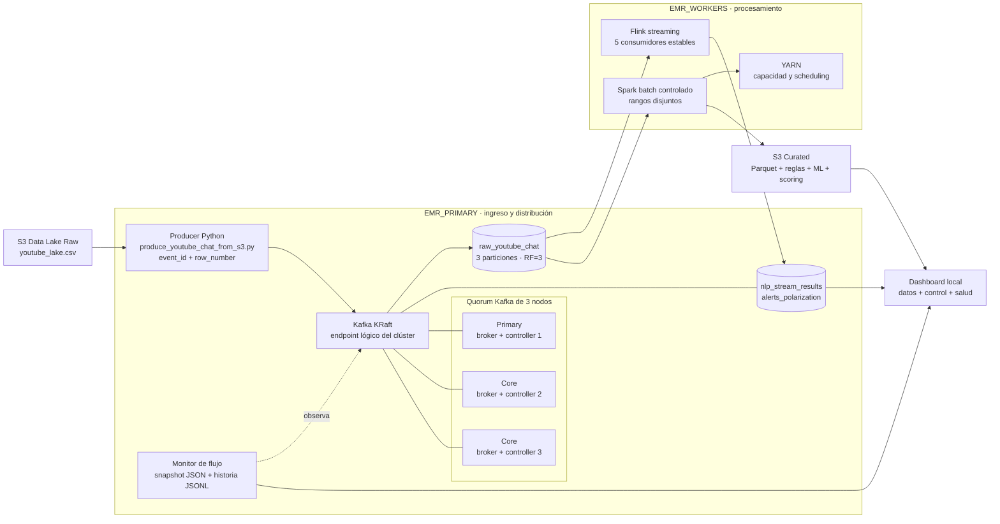
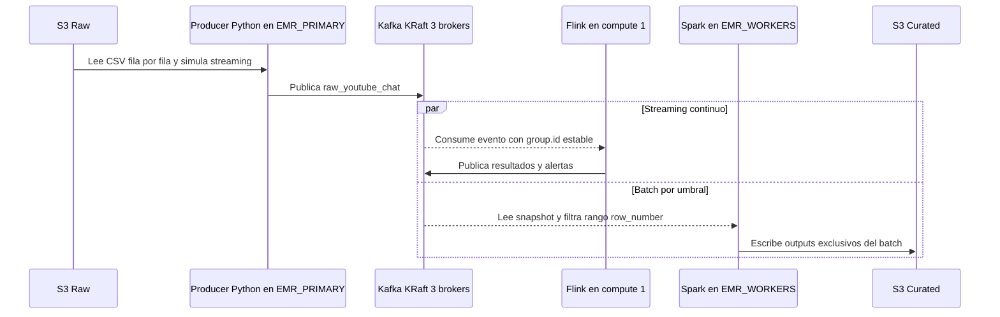
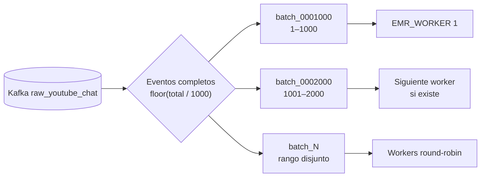
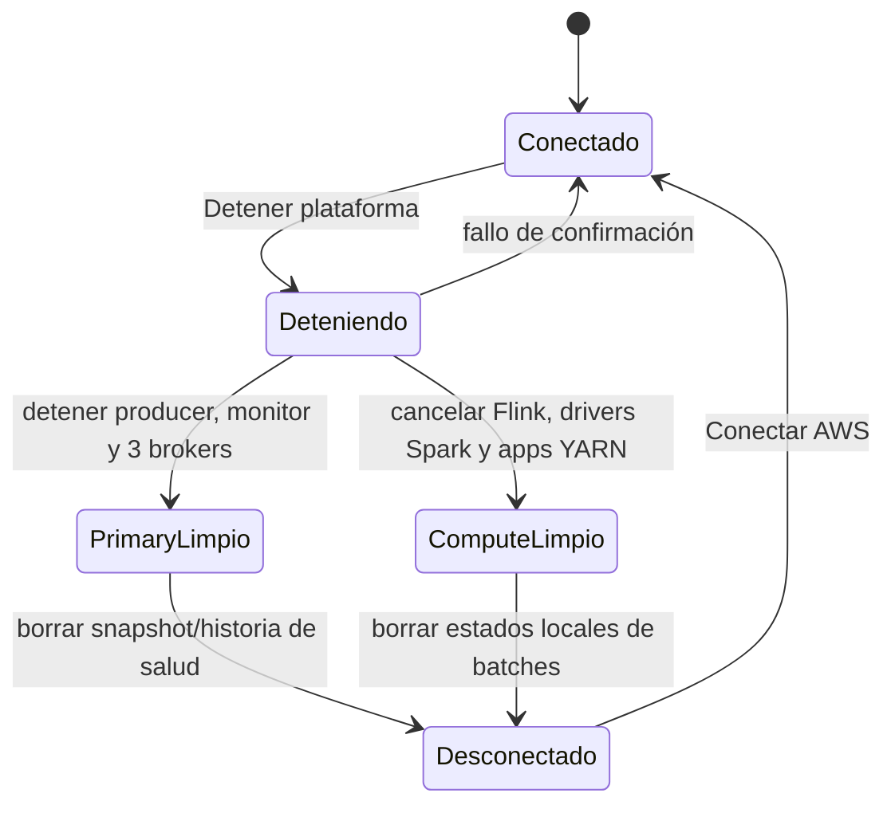

# Arquitectura distribuida vigente

**Repositorio:** [github.com/LaterSpec/bigdata-spark-flink](https://github.com/LaterSpec/bigdata-spark-flink)

## 1. Vista canónica

`EMR_PRIMARY` es la puerta de entrada y el bus central de la plataforma. El script Python `produce_youtube_chat_from_s3.py` lee `youtube_lake.csv` desde el Data Lake, regula la velocidad para simular streaming y publica en Kafka. Desde el topic `raw_youtube_chat`, Kafka habilita dos consumos independientes: Flink streaming y Spark batch. Spark no lee el CSV directamente en este flujo operativo; siempre entra por Kafka.



Las flechas Kafka→Flink y Kafka→Spark representan consumo desde Kafka, no un envío exclusivo. Ambos motores pueden leer el mismo evento porque usan mecanismos de consumo independientes. Flink procesa cada evento en baja latencia; Spark espera a que exista un bloque completo. El Data Lake solo alimenta al producer Python del `primary`; la bifurcación real ocurre recién dentro de Kafka.

## 2. Topología física

| Capa | Ubicación | Responsabilidad |
|---|---|---|
| Datos durables | S3 Raw | CSV original y reconstrucción de la sesión. |
| Ingesta | `EMR_PRIMARY` | Producer Python que simula la cinta en streaming desde S3. |
| Eventos | `EMR_PRIMARY` | Tres brokers/controllers KRaft y monitor. |
| Streaming | Primer endpoint de `EMR_WORKERS` | Cinco jobs Flink con grupos estables. |
| Batch | Todos los `EMR_WORKERS` | Pipelines Spark asignados round-robin sobre YARN. |
| Resultados | Kafka y S3 Curated | Topics de baja latencia y artefactos analíticos por batch. |
| Control | Máquina local | Dashboard, SSH, API y orquestación; `final.pem` nunca se copia a AWS. |

El primary descubre dinámicamente sus dos core nodes. Los core Kafka se administran por DNS privado mediante salto SSH por `EMR_PRIMARY`.

## 3. Flujo de datos



Topics vigentes:

| Topic | Productor | Consumidores | Uso |
|---|---|---|---|
| `raw_youtube_chat` | Producer Lake→Kafka | Cinco jobs Flink y cada batch Spark | Entrada única al procesamiento. |
| `nlp_stream_results` | Jobs Flink 1–4 | Dashboard/monitor | Normalización, ventanas, señales y actores. |
| `alerts_polarization` | Job Flink 5 | Dashboard/monitor | Alertas de riesgo. |
| `nlp_batch_results` | Reservado | Integraciones batch | Salida Kafka opcional; Spark vigente persiste en S3. |

## 4. Spark batch controlado

`SPARK_BATCH_SIZE=1000` crea rangos canónicos e inmutables:



Los batches elegibles forman una cola por rangos. Con `SPARK_MAX_CONCURRENCY=1`, valor operativo seguro, un rango posterior no inicia hasta que el anterior queda `done`. Si se configura más de un worker y se aumenta explícitamente la concurrencia, la asignación usa round-robin; YARN sigue siendo la última autoridad de capacidad.

Antes de evaluar thresholds, el dashboard carga el inventario de estados desde todos los workers. Esto evita que una recarga del navegador relance un batch que ya existe.

Dentro de cada batch sí existe una secuencia obligatoria:

1. Kafka→Parquet, filtrando `row_number` entre `range_start` y `range_end`.
2. Validación de exactamente `SPARK_BATCH_SIZE` filas.
3. Reglas lingüísticas peruanas.
4. Inferencia OffendES Spark ML.
5. Scoring híbrido y agregados.

Cada batch usa rutas S3 exclusivas y un estado atómico en:

```text
/home/hadoop/bigdata-kafka/logs/spark_batches/<batch_id>.status.json
```

El estado registra rango, worker propietario, etapa, filas, timestamps y outputs. El dashboard agrega los estados de todos los workers.
Una solicitud repetida con el mismo `batch_id` es idempotente: si ya existe estado persistido en su worker, el launcher no vuelve a ejecutar ni sobrescribir sus outputs. El reproceso operativo exige `--force` y aun así se rechaza mientras exista el lock de una ejecución activa.

## 5. Kafka KRaft

- Tres nodos combinan roles `broker,controller`.
- `controller.quorum.voters` se genera con los DNS privados actuales.
- Los topics tienen tres particiones, replicación `3` y `min.insync.replicas=2`.
- El bootstrap aborta si no descubre exactamente tres instancias `RUNNING`.
- El producer y el monitor viven en el nodo primary, pero publican/consultan el clúster Kafka completo.
- Reinicializar KRaft elimina topics y offsets; S3 Raw y los modelos no se modifican.

## 6. Observabilidad

El monitor residente mantiene:

```text
/home/hadoop/bigdata-kafka/logs/kafka_flow_health.json
/home/hadoop/bigdata-kafka/logs/kafka_flow_history.jsonl
/home/hadoop/bigdata-kafka/logs/kafka_flow_monitor.log
```

`GET /api/pipeline/health` combina quorum, ISR, offsets, tasas, lag, producer, monitor, Flink, YARN, workers y estados Spark.

## 7. Plano de control

El dashboard local no deja flujos activos por defecto. La secuencia operativa correcta es:

1. Levantar el dashboard local.
2. Pulsar **Conectar AWS**.
3. Dejar que el bootstrap despliegue Kafka en `EMR_PRIMARY`, copie jobs a `EMR_WORKERS`, inicie Flink, el monitor y el producer Python.
4. Esperar a que Kafka acumule eventos; desde ese momento Flink consume en continuo y Spark se activa por bloques de `SPARK_BATCH_SIZE`.

En otras palabras, “levantar el proyecto” localmente solo deja listo el plano de control. La ejecución distribuida empieza cuando el usuario dispara **Conectar AWS**.

## 8. Detener plataforma

El botón es un reset operativo de ambos lados de la arquitectura:



“Conectar AWS” solo se habilita cuando la parada se confirmó en `EMR_PRIMARY` y en todos los endpoints de `EMR_WORKERS`. Si alguna parada falla, la sesión permanece marcada como conectada para impedir una segunda ejecución superpuesta.

## 9. Configuración

```dotenv
EMR_PRIMARY=<DNS público del clúster Kafka>
EMR_WORKERS=<DNS compute 1>,<DNS compute 2>
DATA_SIZE=30000
SPARK_BATCH_SIZE=1000
SPARK_MAX_CONCURRENCY=1
```

El primer worker aloja Flink; todos participan en Spark. Los clústeres deben compartir conectividad privada hacia Kafka `9092`; `9093` se limita al quorum de `EMR_PRIMARY`.

## 10. Recuperación

- Un broker fuera de ISR degrada la plataforma; dos réplicas sincronizadas permiten continuar.
- Si Flink cae, los grupos estables conservan el lag pendiente.
- Si un batch falla, se recalcula únicamente su rango y sus rutas S3.
- Si cambia un DNS público, se actualiza `.env`; los DNS privados se redescubren.
- Si Kafka se pierde, el bootstrap reconstruye el bus desde S3 Raw.

## 11. Semántica del dashboard

- `raw_youtube_chat` y los deltas visuales se consultan cada `3 s`.
- **Flink normalizados** se obtiene del offset confirmado de `flink-job1-normalize`, también incluido en el delta de `3 s`.
- El estado principal muestra **conectado** con foco verde cuando existe una sesión AWS activa. `degraded` se conserva como diagnóstico interno para acciones sobre quorum, Flink o YARN, sin presentar la plataforma como desconectada.
- Una pérdida temporal de Kafka conserva el último estado, muestra el detalle del error y continúa verificando; nunca reinicia automáticamente la plataforma.
