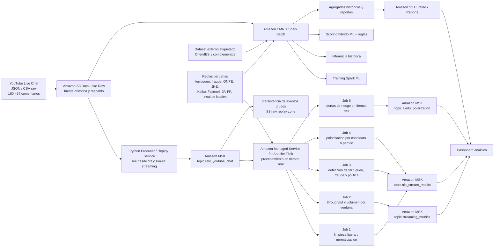

# Arquitectura objetivo del proyecto

## 1. Estado actual

El proyecto ya tiene una base batch real en AWS:

- Data Lake raw en `s3://figuretibucket/`
- Procesamiento historico con Spark Batch en EMR
- Entrenamiento e inferencia NLP con `pyspark.ml`
- Reglas locales peruanas y scoring hibrido

La siguiente evolucion no sera rehacer Spark, sino extender la arquitectura para soportar streaming real sobre AWS.

## 2. Decision de arquitectura

La arquitectura objetivo sera hibrida:

- `S3` seguira siendo la fuente de verdad historica.
- `EMR + Spark` seguira resolviendo entrenamiento, inferencia masiva y agregados historicos.
- `Kafka` sera la capa central de transporte de eventos.
- `Flink` sera la capa de procesamiento streaming de baja latencia.
- El dashboard consumira resultados batch y streaming.

Punto importante: el siguiente paso de implementacion en AWS debe comenzar por Kafka, pero en esta fase solo se actualiza la documentacion y el diseno. Todavia no se crean clusters, topics ni jobs.

## 3. Diagrama objetivo

## 4. Capas y responsabilidades

### 4.1 Capa de almacenamiento

- `Amazon S3 Raw`: conserva el dataset original y sirve para replay.
- `Amazon S3 Curated`: guarda predicciones batch, agregados, metricas y reportes.

### 4.2 Capa de ingesta

- Un `Python Producer / Replay Service` leera el dataset historico desde S3.
- Su responsabilidad sera publicar eventos JSON a Kafka respetando un ritmo configurable.
- Debe soportar:
  - modo rapido de prueba
  - modo con delay fijo
  - modo replay basado en `video_offset_msec`

### 4.3 Capa de streaming

- `Amazon MSK` sera el backbone de eventos.
- Topics previstos:
  - `raw_youtube_chat`
  - `nlp_stream_results`
  - `streaming_metrics`
  - `alerts_polarization`

### 4.4 Capa de procesamiento streaming

- `Amazon Managed Service for Apache Flink` ejecutara los jobs de baja latencia.
- Responsabilidades:
  - limpieza ligera
  - enriquecimiento contextual
  - conteos por ventana
  - deteccion temprana de picos
  - generacion de alertas

### 4.5 Capa batch

- `Amazon EMR` mantendra el procesamiento historico y el entrenamiento distribuido.
- Spark seguira siendo responsable de:
  - training NLP con datasets etiquetados
  - inferencia sobre el corpus completo
  - scoring hibrido ML + reglas
  - agregados historicos
  - reportes reproducibles

### 4.6 Capa de observabilidad y consumo

- `CloudWatch` debera centralizar logs y metricas operativas de MSK, Flink y producer.
- El dashboard final consumira:
  - resultados streaming para monitoreo en vivo
  - resultados batch para analisis historico y respaldo

## 5. Arquitectura AWS recomendada

La recomendacion para la siguiente etapa es usar servicios administrados de AWS siempre que sea posible:

- `Amazon MSK` para Kafka
- `Amazon Managed Service for Apache Flink` para streaming
- `Amazon EMR` para Spark batch
- `Amazon S3` para raw y curated
- `CloudWatch` para logs, alarmas y metricas
- `IAM`, `VPC`, `Security Groups` y subnets privadas para aislar la capa de datos

Razon de esta decision:

- reduce trabajo operativo frente a autogestionar Kafka y Flink en EC2
- mantiene consistencia con la base ya desplegada en AWS
- facilita alta disponibilidad, checkpoints y monitoreo
- permite defender una arquitectura Big Data moderna y clara en el informe

## 6. Fases de implementacion

### Fase A - Completada

- Spark Batch en EMR
- S3 como Data Lake
- modelos y reglas documentados

### Fase B - Siguiente fase documentada

- definir la topologia Kafka en AWS
- definir topics, particiones y retencion
- definir el contrato JSON del evento
- definir seguridad de red, IAM y observabilidad

### Fase C - Implementacion de Kafka en AWS

- crear el cluster Kafka en AWS
- crear los topics
- validar conectividad desde producer y consumidores
- ejecutar pruebas de publicacion y consumo

### Fase D - Implementacion Flink

- desplegar jobs streaming
- medir throughput y latencia
- persistir resultados y alertas

### Fase E - Dashboard e integracion final

- exponer metricas batch y streaming
- consolidar vistas historicas y en tiempo real

## 7. Primer paso recomendado para continuar

Antes de crear infraestructura, debemos cerrar un paquete pequeno de definiciones tecnicas para Kafka en AWS:

1. Elegir si Kafka ira en `Amazon MSK Serverless` o `Amazon MSK Provisioned`.
2. Definir VPC, subnets y security groups donde vivira MSK.
3. Definir topics iniciales, particiones y politicas de retencion.
4. Definir el esquema JSON canonico del evento `raw_youtube_chat`.
5. Definir como se conectaran luego el producer, Flink y consumidores analiticos.

## 8. Que no se hara aun

En esta fase no se hara lo siguiente:

- crear MSK
- crear topics
- desplegar Flink
- modificar EMR
- ejecutar pruebas de red

El objetivo de esta actualizacion es dejar la arquitectura del proyecto alineada con la siguiente expansion en AWS.
