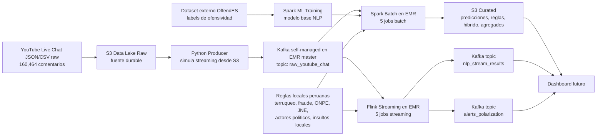

# Current Architecture Mermaid

```mermaid
flowchart LR
    A["YouTube Live Chat JSON/CSV raw<br/>160,464 comentarios"] --> B["S3 Data Lake Raw<br/>fuente durable"]
    B --> C["Python Producer<br/>simula streaming desde S3"]
    C --> D["Kafka self-managed en EMR master<br/>topic: raw_youtube_chat"]

    D --> E["Spark Batch en EMR<br/>5 jobs batch"]
    D --> F["Flink Streaming en EMR<br/>5 jobs streaming"]

    E --> G["S3 Curated<br/>predicciones, reglas, hibrido, agregados"]
    F --> H["Kafka topic<br/>nlp_stream_results"]
    F --> I["Kafka topic<br/>alerts_polarization"]

    G --> J["Dashboard futuro"]
    H --> J
    I --> J

    K["Dataset externo OffendES<br/>labels de ofensividad"] --> L["Spark ML Training<br/>modelo base NLP"]
    L --> E

    M["Reglas locales peruanas<br/>terruqueo, fraude, ONPE, JNE,<br/>actores politicos, insultos locales"] --> E
    M --> F
```
