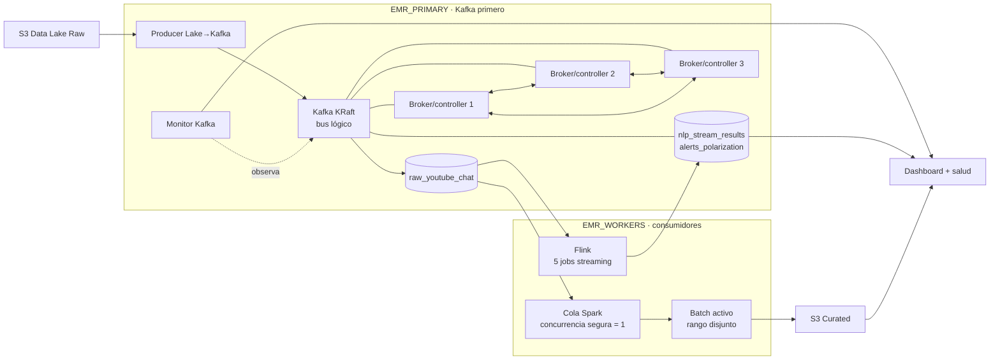

# Arquitectura actual

Este diagrama es el resumen canónico. Kafka en `EMR_PRIMARY` recibe primero los eventos y los expone simultáneamente a Flink y Spark en la capa de cómputo.

Flink y Spark no forman una cadena entre sí. Son consumidores independientes del mismo topic raw: Flink produce resultados nuevamente en Kafka y Spark procesa batches disjuntos en orden seguro y persiste datasets en S3.

La especificación completa está en `architecture.md` en la raíz del proyecto.
