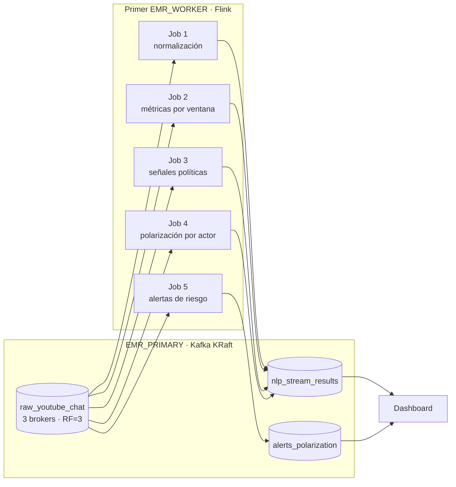

# Flink Streaming Jobs

Los cinco jobs se ejecutan en el primer endpoint de `EMR_WORKERS`. Kafka vive en el clúster separado `EMR_PRIMARY`.

## Flujo



## Consumidores

Cada job usa un grupo estable:

| Job | Group ID | Output |
|---|---|---|
| Normalización | `flink-job1-normalize` | `nlp_stream_results` |
| Ventanas | `flink-job2-window-metrics` | `nlp_stream_results` |
| Señales | `flink-job3-political-signals` | `nlp_stream_results` |
| Actores | `flink-job4-actor-polarization` | `nlp_stream_results` |
| Alertas | `flink-job5-risk-alerts` | `alerts_polarization` |

El source confirma el offset exacto de cada registro procesado. El monitor puede calcular lag sin interferir con el consumo.

El dashboard usa específicamente los offsets confirmados de `flink-job1-normalize` para **Flink normalizados**. La lectura se incorpora a `/api/live-delta`, cuya frecuencia objetivo es `3 s`; el valor se limita por el total RAW y se mantiene monótono dentro de una sesión.

## Build

En el primer compute:

```bash
/home/hadoop/bigdata-kafka/flink/scripts/build_flink_jobs.sh
```

El script compila `FlinkKafkaStreamingJobs.java` contra Flink 1.17.1 y empaqueta las dependencias Kafka client.

## Ejecución

El bootstrap inicia los wrappers:

```text
flink_job1_normalize_stream.sh
flink_job2_window_metrics.sh
flink_job3_political_signals.sh
flink_job4_actor_polarization.sh
flink_job5_risk_alerts.sh
```

Todos reciben `BOOTSTRAP_SERVER` con la lista privada de brokers, `MAX_MESSAGES`, `DELAY_MS`, `IDLE_MS` y, donde corresponde, `WINDOW_SECONDS`.

## Salidas

Los mensajes mantienen:

- `job_name`
- `event_type`
- `processing_ts`
- `source_topic`
- `source_partition`
- `source_offset`
- `payload`

Las reglas detectan terruqueo, fraude electoral, instituciones, actores políticos, insultos generales, lenguaje discriminatorio, spam y señales de polarización.

## Operación

```bash
pgrep -af FlinkKafkaStreamingJobs
tail -f /home/hadoop/bigdata-kafka/logs/flink_job1_normalize_stream.log
```

El panel de salud espera cinco procesos durante una sesión activa. Al completar `MAX_MESSAGES`, los jobs acotados pueden finalizar normalmente.

## Recuperación

Ejecuta nuevamente el bootstrap para recompilar y reiniciar los cinco jobs. Los grupos estables reanudan desde offsets confirmados; después de un reset de topics, `auto.offset.reset=earliest` inicia desde el nuevo comienzo.
