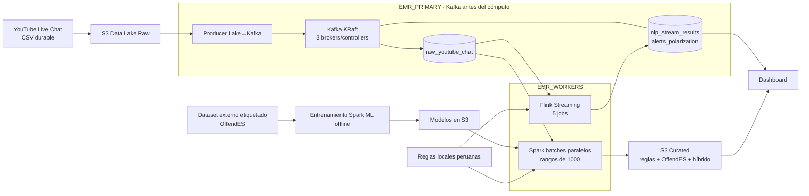

# Plan de pipeline Big Data - Discurso discriminatorio y polarizacion politica

> **Registro histórico:** las tareas y decisiones de fase se conservan como evidencia. El diagrama inicial sí refleja la arquitectura implementada; ante cualquier contradicción posterior prevalece `architecture.md`.

## 0. Idea central del proyecto

Proyecto: **Deteccion y analisis del discurso discriminatorio y polarizacion politica en redes sociales usando Big Data**.

### Estado logrado - plataforma distribuida

- [x] Data Lake en S3.
- [x] `EMR_PRIMARY` de tres nodos dedicado a Kafka KRaft.
- [x] Uno o más `EMR_WORKERS` dedicados a Flink y Spark/YARN.
- [x] Spark Batch ejecutado en EMR.
- [x] Procesamiento Spark sobre 160,464 comentarios.
- [x] Reglas multilabel locales para terruqueo, fraude, instituciones electorales, menciones politicas, polarizacion, lenguaje discriminatorio, insultos y spam/ruido.
- [x] Agregados por minuto usando `video_offset_msec`.
- [x] Reportes en S3.
- [x] Validacion de estabilidad entre muestra de 70k y corrida full.
- [x] Spark ML training con OffendES usando `pyspark.ml`.
- [x] Spark ML inference sobre YouTube full.
- [x] Hybrid scoring con `hybrid_risk_level` y `hybrid_risk_reason`.
- [x] 5 jobs Spark Batch documentados en `docs/SPARK_BATCH_RECORDS.md`.
- [x] Arquitectura vigente documentada en `architecture.md`.

El proyecto debe cumplir lo pedido en la propuesta:

- [x] Declarar y justificar la fuente de datos: YouTube Live Chat electoral peruano recolectado con `yt-dlp`, más OffendES como corpus etiquetado externo.
- [x] Usar Apache Kafka para transmision de datos.
- [x] Usar Apache Flink para procesamiento streaming.
- [x] Usar Apache Spark para procesamiento batch.
- [x] Implementar minimo 2 topics Kafka.
- [x] Documentar 5 jobs streaming con Flink.
- [x] Documentar 5 jobs batch con Spark.
- [x] Aplicar tecnicas NLP.
- [x] Reportar throughput, offsets y lag operativo.
- [x] Mostrar resultados y salud en un dashboard.
- [ ] Preparar informe y demo en vivo.

La fuente principal sera el **Data Lake Raw de YouTube Live Chat electoral peruano**, actualmente con aproximadamente **160,464 comentarios deduplicados**. Como esos comentarios no tienen labels, se integrara un **dataset externo en espanol etiquetado** para entrenar o validar un modelo base de odio/ofensividad/toxicidad.

---

## 1. Flujo general de arquitectura



Explicacion corta:

- El **Data Lake Raw** conserva la data original.
- El **Python Producer** corre en `EMR_PRIMARY` y publica cada fila del Lake en Kafka.
- **Kafka** es el bus central y anterior a todo procesamiento; Flink y Spark consumen el mismo topic raw de forma independiente.
- **Flink** procesa eventos en tiempo real y devuelve sus resultados a topics Kafka.
- **Spark** procesa bloques completos y disjuntos desde Kafka, aplicando modelos ya almacenados en S3.
- El **dataset externo etiquetado** se usa para entrenar porque el dataset peruano aun no tiene labels.
- Las **reglas peruanas** complementan el modelo porque los datasets externos no necesariamente entienden terminos locales como terruqueo, ONPE, JNE, FP, JP o nombres de candidatos.

---

## 2. Bloque 1 - Datos raw ya obtenidos

Estado: este bloque ya esta avanzado.

- [x] Descargar comentarios de YouTube Live Chat con `yt-dlp`.
- [x] Convertir archivos `.live_chat.json` a CSV.
- [x] Consolidar comentarios en un Data Lake raw.
- [x] Deduplicar comentarios repetidos exactos o casi exactos.
- [x] Llegar a un volumen usable para Big Data: aproximadamente 160,464 comentarios.
- [ ] Documentar lista de videos/lives usados.
- [x] Guardar metadata disponible por fuente: `source_file`, `video_id`, timestamps, autor y posición; título/tema quedan como enriquecimiento opcional.
- [ ] Separar carpetas:
  - [ ] `data/raw/live_chat_json/`
  - [ ] `data/raw/csv/`
  - [ ] `data/processed/`
  - [ ] `data/external/`
  - [ ] `data/models/`
  - [ ] `data/metrics/`

Columnas recomendadas para el CSV principal:

- [ ] `source_file`
- [ ] `video_id`
- [ ] `timestamp_text`
- [ ] `timestamp_usec`
- [ ] `video_offset_msec`
- [ ] `author`
- [ ] `author_channel_id`
- [ ] `message_raw`
- [ ] `message_clean`
- [ ] `emoji_count`
- [ ] `is_emoji_only`
- [ ] `has_orange_heart`
- [ ] `event_type`
- [ ] `ingestion_id`

---

## 3. Bloque 2 - Limpieza sin destruir el raw

Regla principal: **no limpiar destructivamente el dataset original**.

- [ ] Mantener siempre una copia raw intacta.
- [ ] Crear un job de limpieza batch con Spark.
- [ ] Crear una limpieza ligera streaming con Flink.
- [ ] Normalizar texto a minusculas para columnas limpias.
- [ ] Quitar URLs de `message_clean`, pero conservar `message_raw`.
- [ ] Separar emojis de texto.
- [ ] Contar emojis.
- [ ] Detectar mensajes solo de emojis.
- [ ] Detectar mensajes de 1 o 2 caracteres sin valor.
- [ ] Conservar siglas politicas utiles:
  - [ ] `JP`
  - [ ] `FP`
  - [ ] `JNE`
  - [ ] `ONPE`
  - [ ] `APP`
  - [ ] `APRA`
- [ ] Detectar spam repetido.
- [ ] Crear columna `is_spam_candidate`.
- [ ] Crear columna `is_noise_candidate`.
- [ ] Crear dataset limpio para NLP textual.
- [ ] Crear dataset separado para metricas sociales/emojis.

Ejemplo de criterio:

- Se puede excluir de entrenamiento textual: `a`, `x`, `jaja`, `:orange_heart:`, emojis solos.
- Se puede conservar para metricas: emojis politicos, corazones, spam de apoyo, repeticion masiva.

---

## 4. Bloque 3 - Kafka

El documento pide minimo 2 topics Kafka.

Topics principales:

- [x] `raw_youtube_chat`
- [ ] `nlp_classified_chat`

Topic opcional:

- [ ] `alerts_polarization`

Checklist:

- [ ] Crear archivo `docker-compose.yml` para Kafka.
- [ ] Crear script de inicializacion de topics.
- [ ] Crear producer Python que lea el CSV consolidado.
- [ ] Enviar cada comentario como JSON.
- [ ] Incluir `event_time`.
- [ ] Incluir `kafka_ingest_time`.
- [ ] Incluir `source_file`.
- [ ] Incluir `video_id`.
- [ ] Permitir velocidad configurable:
  - [ ] modo rapido para pruebas.
  - [ ] modo realista con delay.
  - [ ] modo replay por `video_offset_msec`.
- [ ] Probar consumo desde consola.
- [ ] Medir mensajes enviados por segundo.

Ejemplo de evento Kafka:

```json
{
  "comment_id": "yt_000001",
  "source_file": "live_001.live_chat.json",
  "video_id": "abc123",
  "timestamp_text": "01:23:10",
  "video_offset_msec": 4990000,
  "author_channel_id": "UC...",
  "message_raw": "fraude en la ONPE!!!",
  "event_time": "2026-06-15T22:00:00Z",
  "kafka_ingest_time": "2026-06-15T22:00:01Z"
}
```

---

## 5. Bloque 4 - Flink Streaming

El documento pide 5 jobs streaming distintos. No deben ser el mismo conteo con distinta ventana.

### Job Flink 1 - Limpieza y normalizacion streaming

- [ ] Entrada: `raw_youtube_chat`.
- [ ] Salida: `nlp_classified_chat` o topic intermedio.
- [ ] Hace limpieza ligera en tiempo real.
- [ ] Crea `message_clean`, `emoji_count`, `is_emoji_only`.
- [ ] Justificacion: sirve para preparar comentarios mientras llegan.

### Job Flink 2 - Throughput por ventana

- [ ] Entrada: `raw_youtube_chat`.
- [ ] Salida: metricas al dashboard.
- [ ] Calcula mensajes por segundo o por minuto.
- [ ] Usa ventanas de tiempo.
- [ ] Justificacion: el documento pide throughput Kafka/Flink.

### Job Flink 3 - Deteccion de palabras politicas y terruqueo

- [ ] Entrada: comentarios limpios.
- [ ] Salida: `nlp_classified_chat`.
- [ ] Detecta keywords:
  - [ ] `terruco`
  - [ ] `terruqueo`
  - [ ] `caviar`
  - [ ] `rojo`
  - [ ] `comunista`
  - [ ] `senderista`
  - [ ] `fraude`
  - [ ] `ONPE`
  - [ ] `JNE`
  - [ ] `Keiko`
  - [ ] `Fujimori`
  - [ ] `Sanchez`
  - [ ] `JP`
  - [ ] `FP`
- [ ] Justificacion: streaming permite detectar rapidamente tendencias politicas.

### Job Flink 4 - Polarizacion por candidato o grupo politico

- [ ] Entrada: comentarios clasificados.
- [ ] Salida: agregados por ventana.
- [ ] Cuenta menciones positivas/negativas/ofensivas por candidato.
- [ ] Puede usar reglas de menciones.
- [ ] Justificacion: permite ver cambios de polarizacion durante el live.

### Job Flink 5 - Alertas de toxicidad o fraude

- [ ] Entrada: comentarios clasificados.
- [ ] Salida: `alerts_polarization`.
- [ ] Genera alerta cuando suben terminos ofensivos, odio, fraude o terruqueo.
- [ ] Usa umbrales por ventana.
- [ ] Justificacion: demuestra deteccion en tiempo real, no solo analisis historico.

---

## 6. Bloque 5 - Spark Batch

El documento pide 5 jobs batch distintos.

### Job Spark 1 - Consolidacion raw

- [ ] Entrada: `.live_chat.json` y/o CSV raw.
- [ ] Salida: tabla estructurada consolidada.
- [ ] Extrae columnas estandar.
- [ ] Mantiene `source_file` y `video_id`.
- [ ] Justificacion: Spark trabaja bien con volumen historico.

### Job Spark 2 - Limpieza batch

- [ ] Entrada: tabla raw consolidada.
- [ ] Salida: dataset clean.
- [x] Normaliza texto.
- [x] Detecta ruido/spam basico con limitacion tecnica documentada para regex Unicode en Spark Rules v1.
- [x] Justificacion: batch permite limpiar todo el corpus con reglas consistentes.

### Job Spark 3 - Analisis exploratorio historico

- [ ] Entrada: dataset limpio.
- [ ] Salida: tablas agregadas.
- [ ] Calcula:
  - [ ] top palabras.
  - [ ] top hashtags si existen.
  - [ ] frecuencia por video.
  - [x] frecuencia por minuto.
  - [ ] autores mas repetitivos.
  - [ ] palabras politicas mas usadas.
- [ ] Justificacion: Spark permite analizar todo el historico.

### Job Spark 4 - Entrenamiento ML con dataset externo

- [x] Entrada: dataset externo etiquetado OffendES en S3.
- [x] Salida: modelo base NLP Spark ML binario y multiclase.
- [ ] Pipeline recomendado:
  - [x] `RegexTokenizer`
  - [x] `StopWordsRemover`
  - [x] `HashingTF`
  - [x] `IDF`
  - [x] `LogisticRegression`
- [x] Justificacion: el dataset peruano no tiene labels, por eso se entrena con data externa.

### Job Spark 5 - Inferencia batch sobre comentarios peruanos

- [x] Entrada: dataset peruano raw/limpio por reglas + modelo Spark ML entrenado.
- [x] Salida: comentarios clasificados por reglas multilabel, predicciones Spark ML y metricas.
- [ ] Clasifica:
  - [x] neutral.
  - [x] ofensivo/toxico.
  - [x] odio/discriminatorio.
  - [x] polarizante por reglas.
  - [x] terruqueo por reglas.
  - [x] spam/ruido por reglas Spark Rules v1.
- [x] Justificacion: batch permite clasificar todo el historico y alimentar el dashboard.

---

## 7. Bloque 6 - NLP y labels

Problema:

- [ ] El dataset peruano de YouTube no tiene etiquetas.
- [ ] No se puede entrenar supervision real solo con data raw.

Solucion:

- [ ] Usar dataset externo etiquetado para modelo base.
- [ ] Usar reglas locales peruanas para politica y terruqueo.
- [ ] Opcional: etiquetar manualmente muestra peruana.

Labels recomendados para muestra local:

- [ ] `neutral`
- [ ] `ofensivo`
- [ ] `odio_discriminatorio`
- [ ] `polarizante`
- [ ] `terruqueo`
- [ ] `spam_ruido`

Muestra manual sugerida:

- [ ] 800 comentarios si el tiempo es corto.
- [ ] 1,500 comentarios si se quiere mejor evaluacion.
- [ ] Balancear ejemplos: no elegir solo comentarios ofensivos.

Reglas locales sugeridas:

- [ ] `terruco`, `terruqueo`, `senderista`
- [ ] `caviar`, `rojo`, `comunista`
- [ ] `fraude`, `robo`, `actas`, `ONPE`, `JNE`
- [ ] `Keiko`, `Fujimori`, `FP`
- [ ] `Sanchez`, `JP`
- [ ] emojis politicos o de apoyo, por ejemplo `:orange_heart:`

---

## 8. Bloque 7 - Datasets externos investigados

### Opcion recomendada 1 - OffendES

Link: [OffendES en Hugging Face](https://huggingface.co/datasets/fmplaza/offendes)

Paper: [OffendES: A New Corpus in Spanish for Offensive Language Research](https://aclanthology.org/2021.ranlp-1.123/)

Por que sirve:

- [x] Esta en espanol.
- [x] Tiene comentarios de redes sociales.
- [x] Incluye Twitter, Instagram y YouTube.
- [x] Tiene labels manuales de lenguaje ofensivo.
- [x] Encaja bien con el origen de tu data, porque tu fuente principal tambien es YouTube.

Uso recomendado:

- [ ] Usarlo como dataset externo principal para ofensividad.
- [ ] Mapear sus labels a categorias simples: `ofensivo` / `no_ofensivo`.
- [ ] Entrenar modelo base en Spark ML.
- [ ] Aplicar el modelo sobre comentarios peruanos.

Limitacion:

- [ ] No esta centrado en politica peruana.
- [ ] No detecta terruqueo de forma nativa.

Decision:

- [x] Prioridad alta.

---

### Opcion recomendada 2 - Spanish Hate Speech Superset

Link: [Spanish Hate Speech Superset en Hugging Face](https://huggingface.co/datasets/manueltonneau/spanish-hate-speech-superset)

Por que sirve:

- [x] Esta en espanol.
- [x] Esta enfocado en hate speech.
- [x] Integra varios datasets publicos de odio en espanol.
- [x] Tiene alrededor de 29,855 textos anotados como odio/no odio.
- [x] Puede complementar a OffendES porque odio no es lo mismo que ofensividad general.

Uso recomendado:

- [ ] Usarlo como segundo dataset para entrenar o validar odio/no odio.
- [ ] No mezclarlo directamente sin revisar esquema de labels.
- [ ] Crear una tabla normalizada:
  - [ ] `text`
  - [ ] `label_binary`
  - [ ] `source_dataset`

Limitacion:

- [ ] Puede combinar fuentes distintas con criterios de anotacion diferentes.
- [ ] Puede requerir aceptar condiciones de acceso.

Decision:

- [x] Prioridad alta como complemento.

---

### Opcion recomendada 3 - NewsCom-TOX / DETOXIS

Paper: [NewsCom-TOX en Springer](https://link.springer.com/article/10.1007/s10579-023-09711-x)

Sitio relacionado: [DETOXIS IberLEF 2021](https://detoxisiberlef.wixsite.com/website)

Por que sirve:

- [x] Esta en espanol.
- [x] Esta anotado para toxicidad.
- [x] Incluye comentarios en noticias/articulos.
- [x] Tiene etiquetas relacionadas con racismo, xenofobia, insulto, agresividad, intolerancia y toxicidad.
- [x] Sirve muy bien para justificar lenguaje discriminatorio.

Uso recomendado:

- [ ] Usarlo para reforzar la parte de toxicidad/racismo/xenofobia.
- [ ] Puede usarse como dataset de evaluacion secundaria.
- [ ] Si el acceso a los datos toma tiempo, usarlo como referencia academica en el informe.

Limitacion:

- [ ] Es espanol peninsular, no peruano.
- [ ] Puede requerir solicitud para acceso completo.
- [ ] Esta mas centrado en inmigracion y noticias que en politica peruana.

Decision:

- [x] Prioridad media-alta.

---

### Opcion complementaria - HatEval 2019

Paper: [SemEval-2019 Task 5 HatEval](https://aclanthology.org/S19-2007/)

Sitio: [HatEval shared task](https://hatespeech.di.unito.it/hateval.html)

Por que sirve:

- [x] Incluye espanol.
- [x] Es un benchmark conocido.
- [x] Detecta hate speech en Twitter contra mujeres e inmigrantes.
- [x] Tiene tarea binaria de hate/no hate.

Uso recomendado:

- [ ] Usarlo solo si se necesita benchmark adicional.
- [ ] Puede servir para comparar resultados o citar en el informe.

Limitacion:

- [ ] Dominio limitado: mujeres e inmigrantes.
- [ ] Twitter, no YouTube.
- [ ] Puede no conectar directamente con politica peruana.

Decision:

- [x] Prioridad media.

---

### Opcion complementaria - MEX-A3T

Sitio: [MEX-A3T](https://sites.google.com/view/mex-a3t/home)

Por que sirve:

- [x] Esta en espanol latinoamericano.
- [x] Se enfoca en agresividad en tweets mexicanos.
- [x] Puede ayudar a detectar insulto/agresividad en una variedad de espanol mas cercana a Latinoamerica que datasets peninsulares.

Uso recomendado:

- [ ] Usarlo como complemento si OffendES o Spanish Hate Speech Superset no bastan.
- [ ] No usarlo como dataset principal porque es mexicano, no peruano.

Limitacion:

- [ ] No es politica peruana.
- [ ] No necesariamente incluye odio/discriminacion formal.

Decision:

- [x] Prioridad media-baja.

---

## 9. Decision recomendada de datasets

Orden sugerido:

1. [ ] **OffendES** como dataset principal de ofensividad.
2. [ ] **Spanish Hate Speech Superset** como dataset principal de hate speech.
3. [ ] **NewsCom-TOX / DETOXIS** para justificar toxicidad, racismo y xenofobia.
4. [ ] **HatEval** como benchmark academico adicional.
5. [ ] **MEX-A3T** solo como apoyo latinoamericano de agresividad.

Estrategia final:

- [ ] Entrenar modelo base 1: ofensivo/no ofensivo con OffendES.
- [ ] Entrenar o comparar modelo base 2: odio/no odio con Spanish Hate Speech Superset.
- [ ] Aplicar ambos modelos sobre los 160,464 comentarios peruanos.
- [ ] Agregar reglas locales para:
  - [ ] terruqueo.
  - [ ] polarizacion politica.
  - [ ] fraude electoral.
  - [ ] candidatos/partidos/instituciones.
- [ ] Etiquetar manualmente una muestra peruana si alcanza el tiempo.

---

## 10. Bloque 8 - Dashboard

Herramienta libre sugerida:

- [ ] Streamlit si se quiere avanzar rapido.
- [ ] Flask/FastAPI + frontend simple si se quiere mas control.
- [ ] Superset/Grafana si se quiere enfoque mas dashboard/BI.

Metricas minimas:

- [ ] Total de comentarios procesados.
- [ ] Mensajes por minuto.
- [ ] Throughput.
- [ ] Latencia promedio.
- [ ] Porcentaje ofensivo/toxico.
- [ ] Conteo de terruqueo por ventana.
- [ ] Conteo de menciones por candidato.
- [ ] Top palabras politicas.
- [ ] Alertas de picos de toxicidad.
- [ ] Distribucion spam/ruido vs texto util.

Graficos recomendados:

- [ ] Serie temporal de mensajes por minuto.
- [ ] Serie temporal de toxicidad.
- [ ] Barras de palabras clave.
- [ ] Barras por candidato/partido.
- [ ] Tabla de comentarios clasificados.
- [ ] Indicador de latencia.
- [ ] Indicador de throughput.

---

## 11. Bloque 9 - Metricas requeridas por el documento

### Throughput

- [ ] Medir en Kafka Producer: mensajes enviados por segundo.
- [ ] Medir en Flink: mensajes procesados por segundo o minuto.
- [ ] Guardar en tabla/CSV:
  - [ ] `window_start`
  - [ ] `window_end`
  - [ ] `message_count`
  - [ ] `throughput_msg_per_sec`

### Latencia promedio

- [ ] Incluir `kafka_ingest_time` al producir.
- [ ] Incluir `flink_processed_time` al procesar.
- [ ] Calcular:

```text
latency_ms = flink_processed_time - kafka_ingest_time
```

- [ ] Guardar:
  - [ ] `avg_latency_ms`
  - [ ] `p50_latency_ms`
  - [ ] `p95_latency_ms`
  - [ ] `max_latency_ms`

### Metricas ML

- [ ] Accuracy.
- [ ] Precision.
- [ ] Recall.
- [ ] F1-score.
- [ ] Matriz de confusion.

---

## 12. Bloque 10 - Estructura de carpetas recomendada

```text
bigdata-discurso-politico/
  README.md
  docker-compose.yml
  data/
    raw/
      live_chat_json/
      csv/
    processed/
    external/
    models/
    metrics/
  producer/
    youtube_csv_producer.py
  kafka/
    create_topics.sh
  flink_jobs/
    job_01_clean_stream.py
    job_02_throughput.py
    job_03_keywords_politics.py
    job_04_polarization.py
    job_05_alerts.py
  spark_jobs/
    job_01_consolidate_raw.py
    job_02_clean_batch.py
    job_03_eda_historical.py
    job_04_train_ml.py
    job_05_batch_inference.py
  dashboard/
    app.py
  docs/
    arquitectura.md
    jobs.md
    datasets.md
    metricas.md
    demo.md
```

---

## 13. Bloque 11 - Informe final

Secciones alineadas al documento:

- [ ] Titulo del proyecto.
- [ ] Objetivo general.
- [ ] Objetivos especificos.
- [ ] Fuente de datos y justificacion.
- [ ] Arquitectura general.
- [ ] Arquitectura del cluster:
  - [ ] nodo master.
  - [ ] worker 1.
  - [ ] worker 2.
  - [ ] servicios por nodo.
- [ ] Kafka:
  - [ ] topics.
  - [ ] producer.
  - [ ] formato JSON.
- [ ] Flink:
  - [ ] 5 jobs streaming documentados.
- [x] Spark:
  - [x] 5 jobs batch documentados.
- [x] NLP:
  - [x] limpieza.
  - [x] tokenizacion.
  - [x] stopwords.
  - [x] TF-IDF.
  - [x] modelo ML.
  - [x] reglas peruanas.
- [x] Datasets externos:
  - [x] OffendES.
  - [ ] Spanish Hate Speech Superset.
  - [ ] NewsCom-TOX / DETOXIS.
- [ ] Metricas:
  - [ ] throughput.
  - [ ] latencia.
  - [ ] metricas ML.
- [ ] Dashboard.
- [ ] Demo en vivo.
- [ ] Conclusiones.

---

## 14. Bloque 12 - Orden recomendado de implementacion

### Semana / fase 1 - Base de datos y estructura

- [ ] Crear repo y carpetas.
- [ ] Guardar dataset raw.
- [ ] Validar columnas.
- [ ] Crear README inicial.
- [ ] Crear diagrama Mermaid.

### Semana / fase 2 - Diseno Kafka en AWS

- [ ] Definir si Kafka ira en Amazon MSK Serverless o Provisioned.
- [ ] Definir VPC, subnets y security groups.
- [ ] Definir topics, particiones y retencion.
- [ ] Definir contrato JSON de eventos.

### Semana / fase 3 - Kafka

- [ ] Levantar Kafka en AWS.
- [ ] Crear topics.
- [ ] Crear producer Python.
- [ ] Validar mensajes JSON.

### Semana / fase 4 - Spark batch

- [ ] Consolidar raw.
- [ ] Limpiar batch.
- [ ] Hacer EDA.
- [ ] Integrar dataset externo.
- [ ] Entrenar modelo base.

### Semana / fase 5 - Flink streaming

- [ ] Crear job de limpieza.
- [ ] Crear job de throughput.
- [ ] Crear job de keywords.
- [ ] Crear job de polarizacion.
- [ ] Crear job de alertas.

### Semana / fase 6 - Dashboard y metricas

- [ ] Crear dashboard.
- [ ] Mostrar resultados batch.
- [ ] Mostrar resultados streaming.
- [ ] Mostrar throughput.
- [ ] Mostrar latencia.

### Semana / fase 7 - Informe y demo

- [ ] Documentar arquitectura.
- [ ] Documentar los 10 jobs.
- [ ] Documentar datasets.
- [ ] Preparar demo.
- [ ] Preparar conclusiones.

---

## 15. Riesgos y como defenderlos

### Riesgo 1 - El dataset peruano no tiene labels

Defensa:

- [ ] Se usa dataset externo etiquetado para entrenar modelo base.
- [ ] Se aplican reglas locales peruanas.
- [ ] Se propone etiquetado manual de una muestra.

### Riesgo 2 - Los datasets externos no son peruanos

Defensa:

- [ ] El modelo externo detecta odio/ofensividad general en espanol.
- [ ] Las reglas locales cubren terruqueo, polarizacion y contexto electoral peruano.
- [ ] El informe debe explicar esta diferencia.

### Riesgo 3 - Mucho ruido en YouTube Live Chat

Defensa:

- [ ] El ruido es parte real del problema Big Data.
- [ ] Se clasifica como `spam_ruido`.
- [ ] Se conserva para metricas sociales, pero se excluye del entrenamiento textual si no aporta.

### Riesgo 4 - El modelo simple no es transformer

Defensa:

- [ ] Spark ML con TF-IDF + Logistic Regression / Naive Bayes es defendible para Big Data.
- [ ] El curso evalua arquitectura Big Data, no necesariamente SOTA en NLP.
- [ ] Se puede mencionar transformer como mejora futura.

---

## 16. Checklist final de cumplimiento del documento

- [x] Fuente de datos declarada.
- [x] Fuente de datos justificada.
- [ ] Minimo 2 topics Kafka.
- [x] Tecnicas NLP declaradas.
- [ ] 5 jobs Flink distintos.
- [x] 5 jobs Spark distintos.
- [x] Cada job Spark tiene entrada.
- [x] Cada job Spark tiene salida.
- [x] Cada job Spark tiene justificacion de herramienta.
- [ ] Throughput reportado.
- [ ] Latencia promedio reportada.
- [ ] Dashboard funcional.
- [ ] README con pasos desde cero.
- [ ] Scripts de arranque documentados.
- [x] Dataset usado documentado.
- [ ] Informe completo.
- [ ] Demo en vivo preparada.
